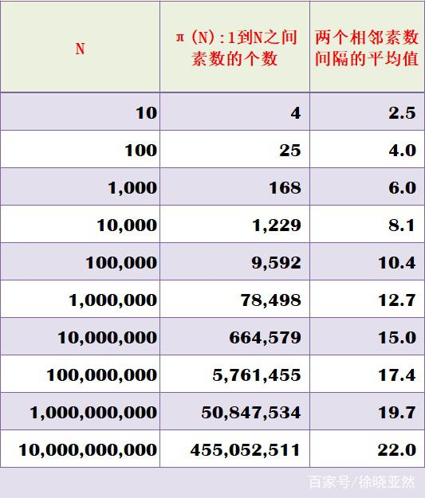

# 等比数列

* 等比数列求和


$∑(1+q^1+q^2+…+q^n)modp$ 已知q,p,n都很大可以到10^9，且q,p不一定互质而且p不一定为质数

* 分治
  
  (1) 1+q1+q2+…+qn fun(n,q)
      
  (2) q1+q2+…+qn (fun(n,q)%p+1%p)%p
      

* 求逆元

  $(q^{n+1}-1)/(q-1) modp=((q^{n+1}-1) modp*inv(q-1))modp$

  求逆元的方法：

  (1)线性打表法（数组有限）
  

  (2) 费马小定理：p是质数而且q，p互质 $inv(q)=(q^{(p-2)})modp$

  (3) 欧拉定理：q，p互质 $inv(q)=q^{φ(p)-1} modp$ 线性打表求欧拉，数组有限

  (4) 拓展欧几里得：q，p互质
  

  逆元不存在，即意味着gcd(b,p)!=1：(a/b)modp=(amod(bp))/b
  
  等比数列的逆元不存在：$((q^{n+1}-1)/(q-1)) modp$ 即q-1%p=0 即q%p=1 则等比数列1+q1+q2+…+qn的每一项%p=1，一共有n+1项，所以求余的结果是n+1（限制条件：p一定是质数的时候，当q-1能整除p可用）


# 素数

* 素数分布
  
* 所有大于2的素数都可以唯一地表示成两个平方数之差。

* 当n为大于2的整数时，$2^n+1$和$2^n-1$两个数中，如果其中一个数是素数，那么另一个数一定是合数。

* 孪生素数：3和5等。

## 素性检测

* 结合哥德巴赫猜想，两个大于2的偶数=两个质数相加(偶数的范围可以达到$10^{18}$) 当质数很大，难用常规方法判断。

```c++
  typedef unsigned long long ll;
  //ll*ll可能会溢出，所以乘法化加法
  ll ModMul(ll a,ll b,ll n)//快速积取模 a*b%n
  {
      ll ans=0;
      while(b)
      {
          if(b&1)
            ans=(ans+a)%n;
          a=(a+a)%n;
          b>>=1;
      }
      return ans;
  }
  ll ModExp(ll a,ll b,ll n)//快速幂取模 a^b%n
  {
      ll ans=1;
      while(b)
      {
          if(b&1)
            ans=ModMul(ans,a,n);
          a=ModMul(a,a,n);
          b>>=1;
      }
      return ans;
  }
  bool miller_rabin(ll n)//Miller-Rabin素数检测算法
  {
      ll i,j,a,x,y,t,u,s=10;
      if(n==2)
        return true;
      if(n<2||!(n&1))
        return false;
      for(t=0,u=n-1;!(u&1);t++,u>>=1);//n-1=u*2^t
      for(i=0;i<s;i++)
      {
          a=rand()%(n-1)+1;
          x=ModExp(a,u,n);
          for(j=0;j<t;j++)
          {
              y=ModMul(x,x,n);
              if(y==1&&x!=1&&x!=n-1)
                return false;
              x=y;
          }
          if(x!=1)
            return false;
      }
      return true;
  }
```

# 对数的敏感性

* log(2)=0.693147

* $sqrt(2)=1.414$ $sqrt(3)=1.732$

* 被9整除 $k*(10^x-1)$

# 调和级数 欧拉公式

* 在n较小的时候没有公式，当n较大(大于一万)

  $f(n)=ln(n)+C+1/(2*n)$ 
 
  $C≈0.57721566490153286060651209$ 

  ```c++
  //对数函数y = lnx的表示方法为log
  f=C+log(n)+1.0/(2.0*n);
  ```

# 加解密

## RSA

* 选取大素数p、q，计算乘积n=p*q

* 根据欧拉函数$r=Phi(n)=Phi(p)*Phi(q)=(p-1)*(q-1)$

* 选择一个小于r并与r互质的整数e，求得e关于r的模反元素，命名为d（ed = 1(mod r)模反元素存在，当且仅当e与r互质），e我们通常取65537。

* e、n公开，d私钥。

    ​A明文，B密文 
    
    $A=B^d mod n$ 

    $B=A^e mod n$

# 质因子分解

* n = $p1^{a1}$ x $p2^{a2}$ x … x $pk^{ak}$ 其中，pi是n的质因子

* 复杂度：质数等于O(sqrt(n))(优化：先打好素数表，是素数就跳出)，合数小于O(sqrt(n))

```c++
typedef long long ll;
int fac[maxn],cnt[maxn];
int getFac(ll n){
	int num=0,sum=0,m=sqrt(n+0.5);
	for(int k=2;k<=m;k++){
		sum=0;
		while(n%k==0){
			n/=k;sum++;
		}
		if(sum!=0){
			fac[num]=k;
			cnt[num++]=sum;
		}
		m=sqrt(n+0.5);
	}
	if(n!=1){
		fac[num]=n;
		cnt[num++]=1;
	}
	return num;
}
```

* 因子总个数 $D = (a1+1) * (a2+1) * … * (ak+1)$

* 因子之和 $S = Π[ 1 + pi + pi^2 + … + pi^{ai}]$
  
* 阶乘的因子分解：给定正整数n，求n!的因子分解式中质因子p的数量，可以用以下公式求解：$S(p)=Σ[n/p+n/(p^2)+n/(p^3)+…+n/(p^k)]$，其中p^k<=n，时间复杂度为O(log(n))。


# GCD & LCM

## GCD的性质

* (1.结合律) GCD(a,b,c)=GCD(GCD(a,b),c)
* (2.区间) GCD(al,…,ar)=GCD(GCD(al,…,am-1),GCD(am,…,ar))
* (3.分配律) GCD(k*a,k*b)=k*GCD(a,b)
* (4.互质) 若GCD(a,b)=p，则a/p与b/p互质
* (5.线性变换) GCD(a+k*b,b)=GCD(a,b)
* (6.因子分解) GCD(a,b)=$Π[pi^{min(ai,bi)}]$

```c++
int gcd(int a,int b){
	return b==0?a:gcd(b,a%b);
}
```

## LCM的性质

* (1.结合律) LCM(a,b,c)=LCM(LCM(a,b),c)
* (2.分配律) LCM(k\*a,k\*b)=k*LCM(a,b)
* (3.因子分解) LCM(a,b)=$Π[pi^{max(ai,bi)}]$

# 欧拉函数

* φ(n)表示所有小于正整数n并且与n互质的正整数的个数
* φ(n) = $Π[ pi^{(ai-1)} ] * Π[ pi-1 ]$
* (性质 1) 对任意正奇数n，φ(n)=φ(2*n)，特别规定φ(1)=1
* (性质 2) 对任意质数n，φ(n)=n-1，$φ(n^k)=(n-1)*n^{(k-1)}$
* (性质 3) 对于正整数n的所有因子di，有Σ[φ(di)]=n
* 积性性质：若a,b互质，则有φ(a\*b)=φ(a)*φ(b)
* 有若p为质数，则$φ(p^k)=p^k-p^{(k-1)}=p^k*(1-1/p)$

* 复杂度：O(sqrt(n))

```c++
int Euler(int n){
	int ret=n;
	for(int i=2;i<=sqrt(n);i++){
		if(n%i==0){
			ret=ret/i*(i-1);
			while(n%i==0)n/=i;
		}
	}
	if(n>1)ret=ret/n*(n-1);
	return ret;
}
```

## 欧拉函数线性筛

* 复杂度O(n)

```c++
const int MAXN=1e7,MAXP=1e6;
int prime[MAXP+10],check[MAXN+10],phi[MAXN+10],num=0;
void GetPhi(){
	phi[1]=1;
	memset(check,0,sizeof(check));
	for(int i=2;i<MAXN;i++){
		if(!check[i]){
			prime[num++]=i;phi[i]=i-1;//素数 
		}
		for(int j=0;j<num;j++){
			if(i*prime[j]>MAXN) break;
			check[i*prime[j]]=1;
			if(i%prime[j]==0){ //i mod p = 0, 那么phi(i * p)=p * phi(i)
				phi[i*prime[j]]=phi[i]*prime[j];break;
			}
			else{
				phi[i*prime[j]]=phi[i]*(prime[j]-1); //phi(prime[j])=prime[j]-1
			}
		} 
	}
	return;
}
```

# 模运算

## 快速幂求模
```c++
long long qPow(long long b,long long p,long long k){
	long long a=b,ans=1;
	while(p){
		if(1&p)ans=(ans*a)%k;
		a=(a*a)%k;
		p>>=1;
	}
	return ans%k;
}
```

* 性质
  1. (a+b)%p=(a%p+b%p)%p
  2. (a-b)%p=(a%p-b%p+p)%p
  3. (a*b)%p=((a%p)*(b%p))%p
  4. (a/b)%p=((a%p)*inv(b))%p，其中inv(b)表示b%p的逆元

* 求正整数a在模mod下逆元的方法
  1. 线性打表法 (只要求mod是质数，时间复杂度O(n))
  2. 费马小定理 (要求mod是质数且与a互质，快速幂优化)
  3. 欧拉定理 (只要求a与mod互质，需要欧拉函数与快速幂)
  4. 拓展欧几里德 (只要求a与mod互质，时间复杂度O(log(n)))


# 同余方程

## 线性同余方程

* 线性同余方程：a*x≡b(mod n)
* 拓展欧几里德定理：对于不完全为0的非负整数a和b，必定存在整数对(x,y)，使等式a\*x+b\*y=gcd(a,b)成立
* 求二元一次不定方程a\*x+b\*y=c的整数解。
  
  当且仅当c%gcd(a,b)=0时，不定方程存在整数解。
  
  特别注意：若不定方程存在整数解，则整数解有无穷多组，拓展欧几里德只能求出其中的一组解，并且求出的解可能是负的。
  
  通解的求法：若(x0,y0)是线性方程a\*x+b\*y=c的一组特解，那么对于任意的整数t，(x0+(b/gcd(a,b))\*t,y0-(a/gcd(a,b))*t)都是线性方程的解。

  

* 求线性同余方程a*x≡b(mod n)的最小正整数解。
  
  解法：首先将方程改写为a*x-n*y=b的形式，然后使用拓展欧几里德求出一组特解(x0,y0)。
  
  题目要求找到最小的正整数解，可以令k=n/gcd(a,n)，这样x的最小正整数解可以通过表达式x=(x0%k+k)%k求出。（x0可能是负数）

  


## 二次同余方程

* Let p = 1000000007. Given two integers b and c, please find two integers x and y(0≤x≤y<p)(0≤x≤y<p), such that (x+y)modp=b 和 (x×y)modp=c 可将题目转化为 x^2-bx+c=0(mod p)求出在模p情况下的二次方程的根
* 欧拉准则
  
  等于1一定有解，等于0可能有，等于-1（或者在求余意义下的其他值）一定没有解
  
  

# 中国剩余定理

* 设正整数N满足线性同余方程组N≡ai(mod pi)，其中 1<=i<=n，pi两两互质，则$N=Σ[ai*Wi*inv(Wi,pi)]%M$。
其中，$M=Πpi=p1*p2*……*pn$，$Wi=M/pi$，$inv(Wi,pi)$表示Wi在模pi下的逆元。


## 拓展中国剩余定理

```c++
//luogu P4777
//first pass luogu & niuke
#include<stdio.h>
#include<iostream>
using namespace std;
const int maxn=1e5+5;
typedef __int128 ll;
int n;
ll a[maxn],b[maxn];
int scan(ll &x){
    x=0;int sgn=1;
    char ch;
    while(ch=getchar()){
        if(ch==EOF)return EOF;
        else if(ch=='-')sgn=-sgn;
        else if(ch>='0'&&ch<='9'){
            x=x*10+(ch-'0');break;
        }
    }
    while((ch=getchar())>='0'&&ch<='9')x=x*10+(ch-'0');
    x*=sgn;return 1;
}
void _print(ll x){
    if(x>9)_print(x/10);
    putchar(x%10+'0');
}
void print(ll x){
    if(x<0){x=-x;putchar('-');}
    _print(x);
}
//a*x+b*y=gcd(a,b)
ll exgcd(ll a,ll b,ll &x,ll &y){
    if(a==0&&b==0)return -1;
    if(b==0){x=1;y=0;return a;}
    ll d=exgcd(b,a%b,y,x);
    y-=a/b*x;
    return d;
}
//china
ll excrt(){
    ll x,y,aa,bb,gcd;
    ll m=a[0],ans=b[0];//a[] divide b[] mod
    for(int i=1;i<n;i++){
        aa=a[i],bb=b[i];
        bb=((bb-ans)%aa+aa)%aa;
        gcd=exgcd(m,aa,x,y);
        if(bb%gcd)return -1;
        x=x*(bb/gcd)%(aa/gcd);
        x=(x+aa)%(aa/gcd);//change the sgn of x, because x maybe - change to +
        ans+=x*m;
        m=m/gcd*aa;
    }
    return ans;
}
int main(){
    scanf("%d",&n);
    for(int i=0;i<n;i++)scan(a[i]),scan(b[i]);
    print(excrt());
    return 0;
}

//extra method
//china x=ai(mod bi) a[] mod b[] divider 
ll excrt(){
    ll x,y,a0=a[0],b0=b[0],a1,b1,gcd;
    for(int i=1;i<n;i++){
        a1=((a[i]-a0)%b[i]+b[i])%b[i],b1=b[i];
        gcd=exgcd(b0,b1,x,y);
        if(a1%gcd)return -1;
        x=x*(a1/gcd)%b1;
        a0+=x*b0;
        b0*=b1/gcd;// b0 finally will be the lcm of all numbers
        a0=(a0+b0)%b0;//change the sgn of a0
    } 
    return a0;
}

//niuke https://ac.nowcoder.com/acm/contest/890/D
//second pass luogu & niuke
#include<stdio.h>
#include<iostream>
using namespace std;
const int maxn=1e2+5;
typedef __int128 ll;
int n;
ll a[maxn],b[maxn];
int scan(ll &x){
    x=0;
    int sgn=1;
    char ch;
    while(ch=getchar()){
        if(ch==EOF)return EOF;
        else if(ch=='-')sgn=-sgn;
        else if(ch>='0'&&ch<='9'){
            x=x*10+(ch-'0');break;
        }
    }
    while((ch=getchar())>='0'&&ch<='9')x=x*10+(ch-'0');
    x*=sgn;return 1;
}
void _print(ll x){
    if(x>9)_print(x/10);
    putchar(x%10+'0');
}
void print(ll x){
    if(x<0){x=-x;putchar('-');}
    _print(x);
}
ll exgcd(ll a,ll b,ll &x,ll &y){
    if(a==0&&b==0)return -1;
    if(b==0){x=1;y=0;return a;}
    ll d=exgcd(b,a%b,y,x);
    y-=a/b*x;
    return d;
}
ll excrt(){
    ll a1=b[0],n1=a[0],a2,n2,d,x,y,gcd;
    //if(a1==0)a1=a[0]; require positive number, so 0 is not correct
    for(int i=1;i<n;i++){
        a2=b[i];n2=a[i];
        d=a2-a1;
        gcd=exgcd(n1,n2,x,y);
        if(d%gcd)return -1;
        x=((x*d/gcd)%(n2/gcd)+(n2/gcd))%(n2/gcd);//k1=x*(d/gcd),k1=(k1%(n2/gcd)+(n2/gcd))%(n2/gcd)
        a1=x*n1+a1;//a1+k1*n1
        n1=n1*n2/gcd;//lcm(n1,n2)
    }
    return a1;
}
int main(){
    scanf("%d",&n);
    ll num;scan(num);
    for(int i=0;i<n;i++)scan(a[i]),scan(b[i]);
    ll ans=excrt();
    if(ans==-1)puts("he was definitely lying");
    else if(ans>num)puts("he was probably lying");
    else print(ans);
    return 0;
}


ll exgcd(ll a,ll b,ll &x,ll &y){
    //cout<<"hh"<<endl;
//  if(a==0&&b==0) return -1;
    ll t,res;
    if(b==0){
        x = 1;
        y = 0;
        return a;
    }
    res = exgcd(b,a%b,x,y);
    t = x;
    x = y;
    y=t - a/b*y;
    return res;
 
}
ll excrt(){
    //cout<<"hh"<<endl;
    int flag ;
    flag = 0;
    ll b1=b[0],a1=a[0],b2,a2,k1,k2,x0,gcd,c;
    ll t;
    for(int i=1;i<n;i++){
        b2=b[i],a2=a[i];
        c=b2-b1;
        gcd=exgcd(a1,a2,k1,k2);//解得：n1*k1+n2*k2=gcd(n1,n2)
        if(c%gcd){
            flag=1;
            //return -1;//无解
            break;
        }
        x0 = k1;
        k1=k1*c/gcd;//n1*x0+n2*(c/gcd*k2)=c  PS:k1/gcd*c错误！
        t=a2/gcd;
        k1=(k1%t+t)%t;//求n1*x0+n2*y=c的x0的最小解
        b1=a1*k1+b1;
        a1=a1*a2/gcd;
        //b1 = (b1%a1+a1)%a1;
   }
    //int res = (int )((N-a1)/n1+(a1==0?0:1));
  
    //int ans  = (N-b1)/a1 + (b1==0? 0:1);
    //int ans = 125;
    if(flag==1) b1 = -1;
    //cout<<"hh"<<endl;
    if(b1==0&&n>1) {
        b1 = a1;
    }
    //if(b1==0&&n==1) b1 =a[0];
    return b1;
 
}
```

# 四色猜想

任何一张地图只用四种颜色就能使具有共同边界的国家着上不同的颜色

# 费马大定理

当整数n >2时，关于x, y, z的方程 $x^n + y^n = z^n$ 没有正整数解

# 康威常数


# 实数域不可拆分多项式只有两种：一次多项式和二次的(b^2<4ac)

*求多项式anx^n+an-1x^(n-1)+…+a1x+a0在实数域上是否可约？n=1，不可约；n=2，根的判别式；n=3，一定实数解（不算虚根i），可以有根号

* 艾森斯坦因判别法：有理数域不可约，即一定要整数解
  

# 阶乘

## 阶乘的位数

* 自己模拟(int)log10(number)+1
  
* 斯特林公式(n=0需要特判，无法求出)
  * 写法（pi和e一定要取多一点，不然会有精度问题，对精度要求高）
  * double PI=acos(double(-1)); 反余弦函数 -1.0为pi，1为0
  * double e=exp(double(1));
  
  

## 阶乘求模

(((n!)!)!)%p=? 阶乘求模

	1. 1!!=1
	2. 2!!=2
	3. 3!!=720
	4. 4!!=620448401733239439360000
	5. 5!!很大
   
所以前面特判，后面的一定能够整除p

* 阶乘末尾0的个数
  * 10！=3,628,800 
  * 20! =2432902008176640000
  * 25!末尾有6个0

* 阶乘算到几位会爆long long n=20的时候会变成负数

# 斐波那契数列

f(n)=f(n-1)+f(n-2)

	1. 递推的方法能够求到80多项，太多无法用long long储存
	2. 递归的方法求能够很快到40多项，时间复杂度高

* 斐波那契因子
  

# 日期转换星期

* 基姆拉尔森计算公式
Week = (d+2*m+3*(m+1)/5+y+y/4-y/100+y/400+1) mod 7；

0-星期日，1-星期一，2-星期二，3-星期三，4-星期四，5-星期五，6-星期六

其中： d为几号，m为月份，y为年份，注：把一月和二月看为是上一年的十三月和十四月

```c++
int check(int y, int m, int d)
 {      
   if (m == 1 || m == 2) m += 12, y = y - 1;
   return (d + 2 * m + 3 * (m + 1) / 5 + y + y / 4 - y / 100 + y / 400 ) % 7; } 
```

* 蔡勒公式

1582年10月4日后：w = (d + 1+ 2*m+3*(m+1)/5+y+y/4-y/100+y/400)%7;

1582年10月4日前：w = (d+1+2*m+3*(m+1)/5+y+y/4+5) % 7;

或者1752年9月3日为例
1752年9月3日后：w = (d + 2*m+3*(m+1)/5+y+y/4-y/100+y/400)%7; 

比上面的少1 说明 6-星期日，0-星期一，1-星期二，2-星期三，3-星期四，4-星期五，5-星期六

1752年9月3日前：w = (d+2*m+3*(m+1)/5+y+y/4+5) % 7;

注：罗马教皇决定在1582年10月4日后使用格利戈里历法；而英国则是在1752年9月3日后才接受使用格利戈里历法。

注意：
当年的1,2月要当成上一年的13,14月进行计算


```c++
int celar(int y, int m, int d)
{
	if (m == 1 || m == 2) {
		m += 12, y--;
	}
	int c = y / 100;
	y = y % 100;
	int w = (c/4-2*c+y+y/4+13*(m+1)/5+d-1) % 7;
	return (w % 7 + 7) % 7;
}
```

# 矩阵快速幂

* 复杂度：O(m^3*log(n)) m是矩阵的大小，第n项
* 一些推导
  
  

* 建立矩阵

  
* 初始化矩阵

  
* 矩阵相乘

  
* 矩阵快速幂

  
* 矩阵乘法

  

  
# 组合数学


* 组合数的性质
    

* 组合数打表
    

## 计算

**在不取模的情况下，要求n的范围非常小才行**

1. 定义计算

* 复杂度：O(m) 组合数横向递推
* 注意乘法溢出，如果要取模则需要预处理逆元
* C(n,0)=1，C(n,k+1)=C(n,k)*(n-k)/(k+1)

    ```c++
    typedef long long ll;
    ll C(int n,int m){
        ll ans=1;
        for(int i=0;i<m;i++){
            ans=ans*(n-i)/(i+1);
        }
        return ans;
    }
    ```


2. 通过递推关系打表，$O(n^2)$打表，O(1)查询，杨辉三角纵向递推
   
   用O(n^2)的时间求出C(0,0)~C(n,n)

   递推关系如下：C(i,0)=1，C(i,j)=C(i-1,j-1)+C(i-1,j)

   乘法运算，加法的递推不容易溢出。注意在不取模的情况下，n不能超过64。在取模的情况下，n主要受到空间的限制，大概是3000以内。

    ```c++
    void getC(){
        for(int i=0;i<=60;i++){
            c[i][0]=1;c[i][i]=1;
        }
        for(int i=1;i<=60;i++){
            for(int j=1;j<i;j++){
                c[i][j]=c[i-1][j-1]+c[i-1][j];
            }
        }
        return;
    }
    ```


**组合数取模**

1. 卢卡斯定理

* **模p是质数且相对比较小**
* 时间复杂度O(plog(n))
* 设N和M是较大的非负整数，p是较小的质数，将n和m写成p进制数，设N[i]与M[i]分别表示N和M在p进制下的第i位数，那么组合数C(N,M)%p可以写成Π[C(a[i],b[i])]%p连乘的形式。
例如：把11写成二进制是(1011)，把5写成二进制是(0101)。
因此C(11,5)%2=(C(1,0)\*C(0,1)\*C(1,0)*C(1,1))%2=0。

    ```c++
    typedef long long ll;
    ll C(ll n,ll m,ll p);
    ll Lucas(ll n,ll m,ll p){
        return m?Lucas(n/p,m/p,p)*C(n%p,m%p,p)%p:1;
    }
    //while循环版本
    ll C(ll n,ll m,ll p);
    ll Lucas2(ll n,ll m,ll p){
        ll ans=1;
        while(n&&m&&ans){
            ans=(ans*C(n%p,m%p,p))%p;
            n/=p;m/=p;
        }
        return ans;
    }
    ```

2. 预处理阶乘逆元表

* **模p为质数**
* O(n)打表，O(1)查询
  
* 线性预处理逆元
  ```c++
    void setInv(int n){
        inv[0]=inv[1]=1;
        for(int i=2;i<=n;i++)
            inv[i]=1ll*(mod-mod/i)*inv[mod%i]%mod;
    }
  ```
* 预处理阶乘以及阶乘逆元求组合数
  ```c++
    void setFac(int n){
        fac[0]=facInv[0]=1;
        for(int i=1;i<=n;i++){
            fac[i]=1ll*fac[i-1]*i%mod;
            facInv[i]=1ll*facInv[i-1]*inv[i]%mod;
        }
    } 
    int C(int n,int m){
        if(n<m)return 0;
        if(n<0||m<0)return 0;
        int ans=fac[n];
        ans=1ll*ans*facInv[m]%mod;
        ans=1ll*ans*facInv[n-m]%mod;
        return ans;
    }
  ```

## 正整数拆分

设f(n,k)表示正整数n被拆成k个数的不同拆法。
使用挡板法，f(n,k)=C(n-1,k-1)。
所以S(n)=Σf(n,k)=ΣC(n-1,k-1)=2^(n-1)

## 小球盒子


## 杨辉三角


## 卡特兰数

* 其前几项为（从第零项开始） : 1, 1, 2, 5, 14, 42, 132, 429, 1430, 4862, 16796, 58786, 208012, 742900, 2674440, 9694845, 35357670, 129644790, 477638700, 1767263190, 6564120420, 24466267020, 91482563640, 343059613650, 1289904147324, 4861946401452

    

* 卡特兰数的一些性质

    

## 错排问题

* 递推

    

## 容斥原理

* (𝐴∪𝐵)=𝐴+𝐵−(𝐴∩𝐵)

* (𝐴∪𝐵∪C)=𝐴+𝐵+𝐶−(𝐴∩𝐵)−(𝐵∩C)−(𝐶∩𝐴)+(𝐴∩𝐵∩𝐶)

* 在1到N的范围内，有多少个正整数可以被2、3、5中的任意一个整除?能被2整除的数有N/2个，能被3整除的数有N/3个，能被5整除的数有N/5个，然后考虑重叠部分。能同时被2和3整除的有N/6个，能同时被2和5整除的有N/10个，能同时被3和5整除的有N/15个，能同时被2和3和5整除的有N/30个。


## 鸽巢原理&抽屉原理

* 把(n+1)个元素放到n个集合中去，必定会有两个元素属于同一个集合，也必定会有一个集合中至少有两个元素。
推论：把(m*n+1)个元素放到n个集合中去，则至少有一个集合中存在不少于(m+1)个元素。

* 拉姆塞定理：在6个人当中，至少有3个人互相认识或者互相不认识。

# 高斯消元

* 求解线性方程组Ax=B，已知关于x=(X1,X2,…,Xn)的n个线性方程组，求方程组的解向量x
* 时间复杂度O(n^3)
* 高斯消元
    
* 模板


## 取模问题
* 要求6/4输出2，ans=(n-1)/k+1;

# 条件概率

* 条件概率
  * 在已知事件B发生的条件下，A发生的概率，记为P(A|B)。计算公式：P(A|B)=P(AB)/P(B)
  * 全概率公式：P(A)=P(B1)xP(A|B1)+…+P(Bn)xP(A|Bn)。B1,…,Bn是互不相容的事件，且U(B1,…,Bn)=全集Ω

# 期望

* 性质
    1. E(c)=0，其中c为任意常数
    2. E(a\*X)=a*E(X)，其中a为任意常数。
    3. E(a\*X+b\*Y)=a\*E(X)+b*E(Y)，期望的线性性 

## 期望的线性性

* 期望的线性性
	* 随机游走(链和图)
	1. 一个长度为n的链，从一端走到另一端的期望时间？设dp[i]表示从i第一次到i+1所需要的期望时间，则dp[i]=1/2+1/2*(1+dp[i-1]+dp[i]) 得dp[i]=dp[i-1]+2。dp[1]=1（1到2只能前进）。ans=dp[1]+dp[2]+……+dp[n-1]=(n-1)^2

	2. N个点的完全图，问从S走到T的期望时间？ans=1/(n-1)+(n-2)/(n-1)\*(ans+1)得1/(n-1)*ans=1得ans=n-1。


例题3：有n(n<=20)个格子，每次会涂一个格子，其中涂第i个格子的概率是p_i（保证∑p_i=1）。求每个格子都被涂色的期望次数。（类似的例题：HDU 4336）

状压dp+概率：二进制1认为当前格子已经被涂色。dp[1<<n-1]=0,dp[0]为所求的答案。

转移：从0开始转移。

```c++
int sum=(1<<n)-1;
dp[sum]=0;//涂满的期望次数为0
for(int i=sum-1;i>=0;i--){
	dp[i]=1;
	double tmp=0;
	for(int j=0;j<n;j++){
		if((i&(1<<j))==0){
			dp[i]+=dp[i+(1<<j)]*p[j];
			tmp+=p[j];
		}
	}
	dp[i]/=tmp;
}
cout<<dp[0]<<endl;
```