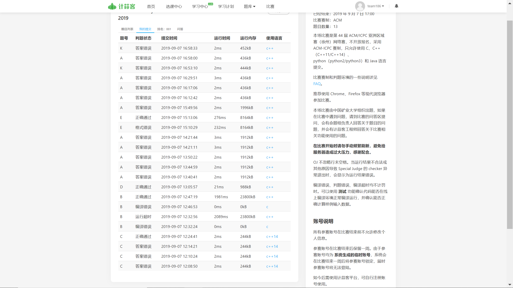
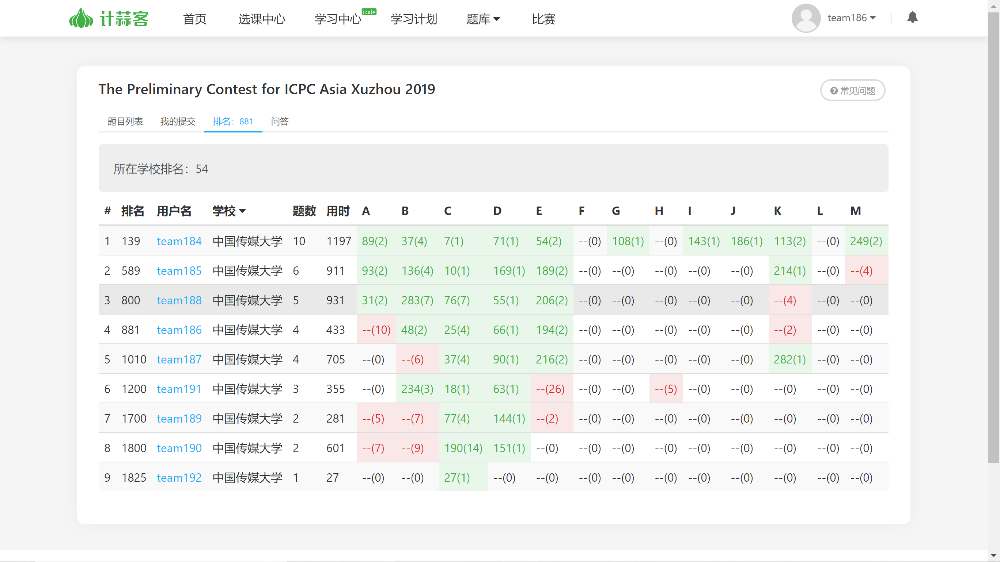

# 徐州总结

## 比赛过程

1. 签到题：买西瓜(CF原题，~~可能做过但是宗老师和紫紫都没印象~~)

   WA三次原因：`题意读错`。用了四种方式枚举题意，第四次最终理解了half的意思。最终宗老师敲过了。

   总结：慎重慎重再慎重，有时候需要抠字眼，不应该惯性思维，以为half就是均分。

2. B题：并查集。宗老师和紫紫WA死于签到题的时候，彪哥在想B题，思路出的快，马上想到用并查集。

   WA原因：思路正确，但是并查集没有路径压缩。

   总结：并查集路径压缩经常忘，要多敲。

3. D题：看了题意之后发现用string直接比较可过，水题，彪哥一发过了。

   总结：应该早点看到这道题。

4. A题：郭颐队很快过了A题，我们以为可能很容易。宗老师做完签到题后，然后宗老师去推A题。A题是博弈+拓展中国剩余定理。宗老师第一次规律推错后，和彪哥讨论，重新写了一个结论，还是WA。后来紫紫以为是拓展中国剩余定理的问题，于是换了三个板子之后，还是不对。最后彪哥又推出一个思路，还是WA。直到比赛结束后我们都没推出正确规律，然后放弃。这题是`斐波那契博弈`，没见过。（郭颐队做出来是因为他们做过类似的）

   总结：没做过也没推对，博弈练得少，造就了比赛WA最多次的题目。

5. E题： 彪哥过完D题后，开始想E题，这道题的思路想出来耗时稍微长，但是想到了维护位置和值、从后往前维护位置之后，思路变得流畅，彪哥敲完。格式错误是因为写着写着又忘记了末尾空格。

   总结：注意要在输出之前，多看看是否有空格（~~一般都没有~~）

6. K题：后1个小时，宗老师思考这道题，并和彪哥讨论了思路，两人开始敲，都WA了。比赛结束后发现最终错在思路有一小部分缺陷，没有考虑点一样时候中点是自己，也应在考虑范围内。

   总结：思路问题，时间充裕的话，或许可以排错。这道题在快结束的时候才敲，后期时间紧张，不利于沉下心来思考漏洞。

## 比赛总结

签到题出的很不顺利，由于读题原因，其他的题目应该要能保证一发过，但是却因为一些小细节问题，A题虽然有规律，然而我们队内推规律都不太行。彪哥、宗老师带飞这场比赛。紫紫全程读题工具人，无法出思路，希望紫紫能够提高自己的码力，做到有自己的思路，并且能流畅的敲出来，在队里能早日找到自己的定位，可以不依赖队友，独自敲题，早日做队内的小太阳。