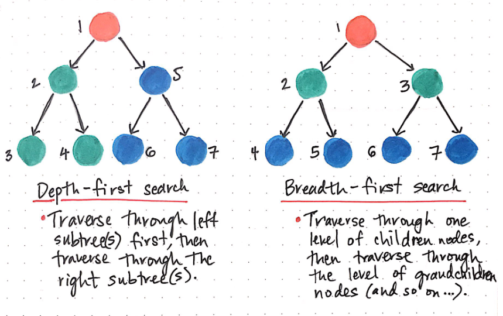
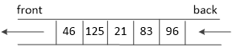
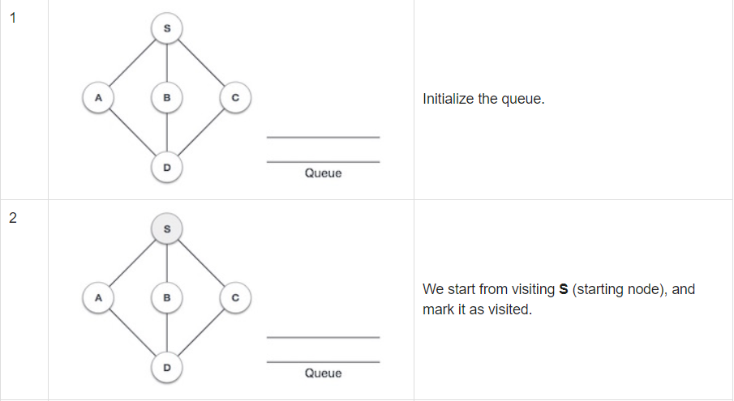
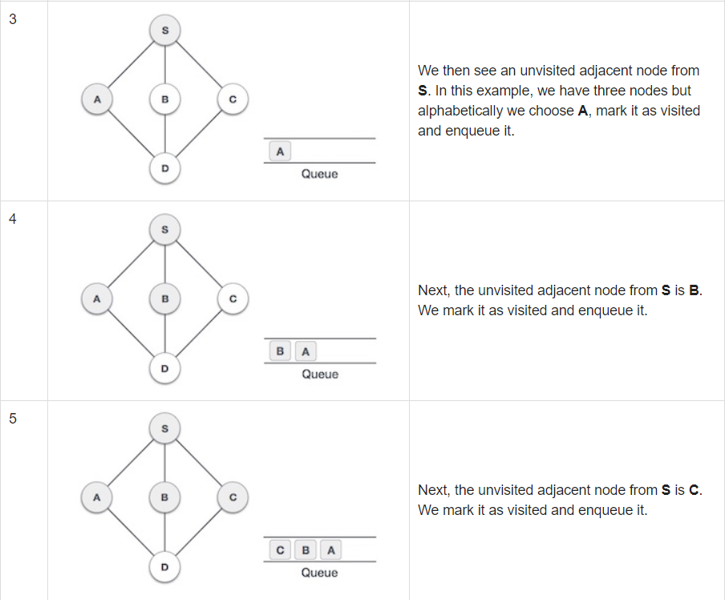
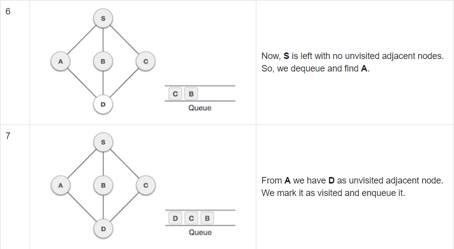

# BFS(Breadth-First Search)

### 广度优先搜索(宽度优先搜索)

---

# DFS & BFS


---

# 队列是BFS的实现工具
* 先进先出FIFO(Fisrt In First Out)

* 一般不自己实现，需要用到`c++ stl(Standard Template Library)`模板库`queue`，需加上头文件`#include<queue>` 
* 普通队列

  ```
  queue<int> q;          定义一个存整形数据int的队列
  q.pop()                弹出队列首元素 要先判断队列是否为空
  e=q.front()            得到队列首部元素，队列首元素不出队
  e=q.back()             得到队列尾部元素，队列尾部元素不出队
  q.empty()              while(!q.empty()) 表示队列不为空
  q.size()               获得队列元素总数
  q.push(e)              将元素插入到队列尾部
  ```
  * 可以存储自定义结构体的队列，将int改为自定义的结构体

---

# 优先队列
* 无论入队顺序，具有最高优先级先出队
* 最大优先队列，无论入队顺序，当前最大的元素优先出队
* 最小优先队列，无论入队顺序，当前最小的元素优先出队
```c++
#include<queue>
priority_queue<int,vector<int>,greater<int> > q; // 升序排列
priority_queue<int,vector<int>,less<int> > q; // 降序排列 
priority_queue<int> q; // 默认从大到小排序
q.top() // 取队首元素
```
---

```c++
//定义结构，使用运算符重载,自定义优先级
struct cmp1{  
    bool operator ()(int &a,int &b){  
        return a>b;//最小值优先  
    }  
}; 
priority_queue<int,vector<int>,cmp1> q;//最小值优先 

//定义结构，使用运算符重载,自定义优先级  
struct number1{  
    int x;  
    bool operator < (const number1 &a) const {  
        return x>a.x;//最小值优先  
    }  
}; 
priority_queue<number1> q;  
```
---

# BFS的过程 Step One


---

# Step Two



---

# Step Three


---

# 伪码

```c++
初始化队列q;
q.push(起点); // 将起点入队
while(!q.empty()){ //队列非空
	u=q.front(); // 取出q队首元素
	q.pop(); // u出队
	vis[u]=1; // 将u设为已访问
	.... // 执行相应代码
	所有与u相邻且未被访问过的点入队
}
```
---

## 走迷宫，最短路径

例题：给一个$n×n$的迷宫，其中1表示墙壁，0表示可走，只能横着走或竖着走，不能斜着走，找出从左上角到右下角的最短路线的长度。
```c++
输入：第一行为n，后面为矩阵
5
0 1 0 0 0
0 1 0 1 0
0 0 0 0 0
0 1 1 1 0
0 0 0 1 0
```
```c++
输出：8
```
---

```c++
// 定义结构体
typedef struct node{
   int x,y,cnt;// x,y为坐标，cnt起点到当前点的长度
   node(){}
   node(int xx,int yy,int c){
      x=xx,y=yy,cnt=c;
   }
}node;
```
---

```c++
int dir[4][2]={{-1,0},{1,0},{0,-1},{0,1}}; // 上下左右
int jud(int x,int y){
   if(x>=0&&x<n&&y>=0&&y<n)return 1; // 判断边界条件
   return 0;
}
int BFS(int stx,int sty,int enx,int eny){
   queue<node> q; // 队列中存储node结构体
   q.push(node(stx,sty,0)); // 将起点入队，初始距离为0
   while(!q.empty()){
      node tm=q.front();q.pop();
      vis[tm.x][tm.y]=1; // 将已经访问过的点置为vis
      if(tm.x==enx&&tm.y==eny) return tm.cnt;  // 已经到达终点
      for(int i=0;i<4;i++){
         int tmx=tm.x+dir[i][0],tmy=tm.y+dir[i][1];
         // 没有被访问过，满足边界条件和可走的情况下才能入队
         if(jud(tmx,tmy)&&!vis[tmx][tmy]&&maze[tmx][tmy]==0){
            q.push(node(tmx,tmy,tm.cnt+1));//距离为当前点距离+1
         }
      }
   }
}
```
---

## Game23
* 给出$n,m$，$n$经过$×$$2$或$×$$3$后能够到达的$m$的次数。
* 用BFS实现
* 上限：超过$m$的值不入队，注意入队会有重复的，用`vis数组`表示该数已经被搜过，否则可能会MLE（同理在迷宫题也需要vis数组防止重复跑已经BFS过的点）


