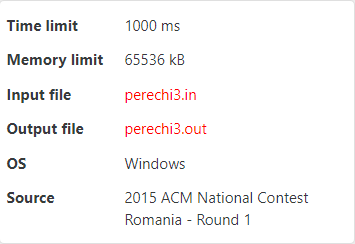

<!-- $theme: default -->
---

# <center> **第二课：循环结构程序设计**  
  
  
---

# 目录

## 1.简单巩固
## 2.for循环
## 3.while & do-while 循环
## 4.break & continue
## 5.算法竞赛中的输入输出

---

### 1.1 变量 & 数据类型
* int,long long,double
### 1.2 运算符
* 算数运算符 + - * / % ++ --
* 关系运算符 > < == !=
* 逻辑运算符 && || !
* 赋值运算符 = +=
### 1.3 顺序结构与选择结构
```cpp
if(条件表达式){
    代码语句;
}
else if(条件表达式){
    代码语句
}
else {
    代码语句;
}
```


---

### The King of High GPA
**zls的绩点实在是太高了，让人忍不住吹他，在场的每一个人都要说"zlsnb!"来表达自己对zls的赞美之情。给出人数n，打印输出n次"zlsnb!"(不包含引号)。**

输入 #1
```
2
```

输出 #1
```
第1个人:zlsnb!
第2个人:zlsnb!
```

* n=2，我们可以写两次printf
* 当n特别大的时候，用循环处理

---

## for 循环
  
  > 格式：**`for(初始化;循环条件;增量) {循环体;}`** 
  > {}在只有一条语句时可省略
  > 括号内的三部分可以省略，for(;;)死循环
  
执行顺序：
* 第一次循环
   * 初始化
   * 是否满足循环条件
   * 满足则执行循环体，否则跳出循环
   * 增量
* 下次循环
   * 首先判断是否满足循环条件
   * 满足则执行循环体，否则跳出循环
   * 增量
  
---
* 第一次循环
  假设n为5，i被初始化成1，满足小于等于n的条件，则执行printf语句，i++相当于i=i+1，i变为2。
* 下次循环
   i为2，满足小于等于n的条件，则执行printf语句。i继续加1，变为3，当i递增到大于n时，不满足循环条件，则跳出。

  ```cpp
  #include<stdio.h>
  int main()
  {
    int n;//变量定义 
    scanf("%d",&n);//输入 
    //i是局部变量，只在循环内生效
    for(int i=1;i<=n;i++){ //也可以写成++i
        printf("第%d个人:zlsnb!\n",i);//打印输出 
    }
    return 0;
  }
  ```
---

### The King of Swimming
打div2好难啊，zls想。于是他准备划水，已知他第一步能划2米，每次划水会消耗大量力气，他接下来的每一次都只能划出上一次划水距离的98%，如果他要划到距离为$x$米的地方，他需要划多少次呢？
 	
输入格式
```
输入一个数字（不一定是整数，小于100米），表示要划的目标距离。
```

输出格式
```
输出一个整数，表示zls一共需要划多少次。
```

输入 #1
```
4.3
```

输出 #1
```
3
```

---
思路：循环枚举次数，直到总距离大于等于$x$时循环跳出。

```cpp
#include<stdio.h>
int main()
{
	double b,ans=0,tmp=2;
	scanf("%lf", &b);
	int i;
	for (i=0;ans<b;i++){ //当总距离大于给定距离时，跳出循环
		ans += tmp;//记录总距离
        	tmp *= 0.98;//记录上一次的距离
	}
	printf("%d\n",i);
	return 0;
}
```
变量$i$在for循环外仍然可以使用，要是写成下面那样会出错吗？
```cpp
for(int i=0;ans<b;i++){
...
}
printf("%d\n",i);
```


---

### The King of Magic (Easy Version)
zls有魔法，他能改变`任意大于1`的自然数$n$，当$n$为奇数，则将$n$变为$3n+1$，否则变为$n$的一半。经过若干次施法后，他一定能使得$n$为1。但是每次施法他都要消耗一点体力，在施法之前他想知道一共需要施多少次法好提前储存体力。zls会告诉你$n$的大小，你需要向zls展现你的能力(~~好让zls收你做小弟~~)！已知$n \leq 10^9$。

---

输入 #1 
```
3
```

输出 #1
```
7
```

输入 #2
```
987654321
```

输出 #2
```
180
```

样例解释 #1
```
3 -> 10 -> 5 -> 16 -> 8 -> 4 -> 2 -> 1 
```
---

* 重复性的工作，可用循环实现
* `循环的次数不确定`，而且也不是`递增式`的循环，~~用for循环处理~~
* 明确了循环条件，用while循环处理

---

## while 循环
>格式：while(条件) 循环体; \\\while(ture)或者while(1)，会变成死循环
>用while循环改写for循环
>增量写在循环体内部
```cpp
#include<stdio.h>
int main()
{
	int n,i=1;
	scanf("%d",&n);
	while(i<=n){
		printf("第%d个人:zlsnb!\n",i);
        	i++;
        	//printf("第%d个人:zlsnb!\n",i++); 
	}
	return 0;
}
```
---

### 有坑，警告
**如何查错:`输出中间变量`的方法**
```cpp
#include<stdio.h>
int main()
{
	int n,cnt=0;
	scanf("%d",&n);
	while(n>1){
		if(n%2==1){
			n=3*n+1;
		}
		else{
			n/=2;
		}
		cnt++;//++cnt
        	//printf("n=%d\n",n); //输出中间变量查错
	}
	printf("%d\n",cnt);
	return 0;
}
```

---
$n \leq 10^9$虽然在int的范围以内($-2147483648～2147483647$),但是当$n$为99999999，此时乘3之后就会溢出，需用long long变量存

```cpp
#include<stdio.h>
int main()
{
	long long n;
	int cnt=0;
	scanf("%lld",&n);
	while(n>1){
		if(n%2==1){
			n=3*n+1;
		}
		else{
			n/=2;
		}
		cnt++;
	}
	printf("%d\n",cnt);
	return 0;
}
```

---

## do-while 循环
>格式：**`do { 循环体 } while(条件);`**
>循环体至少执行一次，每次执行完循环体后判断条件
>用do-while循环改写for循环
>一定要记得while后的分号
```cpp
#include<stdio.h>
int main(){
	int n;
	scanf("%d",&n);
	int i=1;
	do{
		printf("第%d个人:zlsnb!\n",i++);
	}while(i<=n);
	return 0;
}
```
---

### The King of Magic (Hard Version)
天天打div2的缘故，zls的能力变强了，对于任意自然数$n$，经过上述的若干次施法，一定能使得$n$为1。小弟你向zls效力的时候到了，zls会给你$n$，需要你帮他求施法次数。已知$n \leq 10^9$。(去掉$n>1$的条件)

---

* 方法一：特判$n=1$，输出$3$
* do-while
```cpp
#include<stdio.h>
int main()
{
	long long n;
	int cnt=0;
	scanf("%lld",&n);
	do{
		if(n%2==1){
			n=3*n+1;
		}
		else{
			n/=2;
		}
		cnt++;
	}while(n>1);
	printf("%d\n",cnt);
	return 0;
}
```

---

## break & continue
* break表示跳出循环
* continue表示结束本次循环，进行下一次循环，只能用于循环结构

---

### The King of Prime Numbers (Easy Version)
zls对质数产生了兴趣，质数是什么呢？(指大于1的自然数中，除了1和它本身以外不再有其他因数的自然数)
当然，为了成为数论之王，他更想知道如何判断一个数是不是质数呢，你能帮帮他吗？
已知输入一个大于1的数$n$，如果该数是素数，则输出"YES"，否则输出"NO"。(引号不输出，$2 \leq n \leq 500$) 

---
输入 #1
```2```
输出 #1
```YES```

输入 #2
```100```
输出 #2
```NO```

输入 #3
```233```
输出 #3
```YES```

---

# break

```cpp
#include<stdio.h>
int main()
{
	int n,flg=0;
	scanf("%d",&n);
	for(int i=2;i<n;i++){
		if(n%i==0){
			flg=1;
            	//当已经找到了它的因子，就不需要再进行后续的循环
			break;
		}
	}
	if(flg==1)printf("NO\n");
	else printf("YES\n");
	return 0;
}
```

---

# continue
 continue之后的语句不会被执行，直接执行增量(i++)
	
```cpp
#include<stdio.h>
int main(){
	int n,flg=0;
	scanf("%d",&n);
	for(int i=2;i<n;i++){
		if(n%i!=0)continue;
		flg=1;break;
	}
	if(flg==1)printf("NO\n");
	else printf("YES\n");
	return 0;
} 
```
---

## 嵌套循环
> for循环，while循环和do-while循环可以相互嵌套
> 可以在任何类型的循环内嵌套其他任何类型的循环
> c++至少允许256个嵌套层次

---

### The King of Prime Numbers (Hard Version)
数论之王zls是素数狂热者，他需要找到$1$到$n$范围内的所有素数。已知一个正整数$n$，要求输出$1$到$n$范围内的所有素数的个数。($1$ $\leq n \leq$ $1000$)
输入 #1
```
100
```
输出 #1
```
25
```
输入 #2
```
999
```
输出 #2
```
168
```
---

```cpp
#include<stdio.h>
int main(){
	int n,cnt=0;
	scanf("%d",&n);
	for(int i=2;i<=n;i++){//遍历2~n，因为1不是素数 
		//判断是否为素数
		int flg=0;
		for(int j=2;j<i;j++){
			if(i%j==0){
				flg=1;
				break;
			}
		} 
		if(flg==0)cnt++;
	}
	printf("%d\n",cnt);
	return 0;
} 
```
---

## 计时函数
`通常我们都不用，在敲题之前会先估算好所需的时间复杂度`~~会在第七课学~~
```cpp
#include<time.h> // 头文件

//在主函数return 0前加入
printf("Time used = %.2f\n",(double)clock()/CLOCKS_PER_SEC);
```
> 计时函数clock() 返回程序目前为止运行的时间,在程序结束之前调用此函数，便可获得整个程序的运行时间,除以常数CLOCKS_PER_SEC得到的值以秒$s$为单位。
> 键盘输入时间算在内，所以输入数据到键盘的时间也会影响总时间


---

## 算法竞赛中的输入输出
* 多组样例
例如，给出整数a和b的值，输出a+b，输入包含多组数据，处理到文件结束。

输入 #1 
```
1 2 
2 3 
3 4 
```
输出 #1
```
3 
5 
7 
```

---
### C语言
EOF在C标准函数库中表示`文件结束符(end of file)`，在while循环中以EOF为文件结束标志。在命令行中输入Ctrl+z可以结束输入。
```
#include<stdio.h>
int main(){
	int a,b;
	while(scanf("%d%d",&a,&b)!=EOF){
		printf("%d\n",a+b);
	}
	return 0;
} 
```

---
~是取反的意思，scanf的返回值代表正确按指定格式输入变量的个数,即取值范围是大于等于-1的。EOF的值为-1，当读入为EOF时，取反之后为0(~~涉及到计算机补码~~)，从而跳出while循环。而其他输入情况下，while循环非0。
```
#include<stdio.h>
int main(){
	int a,b;
	while(~scanf("%d%d",&a,&b)){
		printf("%d\n",a+b);
	}
	return 0;
} 
```
---
### c++
```
#include<iostream>
using namespace std;
int main(){
	int a,b;
	while(cin>>a>>b){
		cout<<a+b<<endl;
	}
	return 0;
} 
```
当题目是多组数据且处理到文件结束的情况下，一定要写EOF或者~(`推荐使用`)，不然可能会报错

---

给出整数a和b的值，输出a+b，输入包含T组数据。输入的第一行为T，之后的T行分别是a和b的值。
输入 #1
```
2
1 2
2 3
```
输出 #1
```
3
5
```

---

```cpp
#include<stdio.h>
int main()
{
	int a,b,t;
	scanf("%d",&t);
	while(t--){
		scanf("%d%d",&a,&b);
		printf("%d\n",a+b);
	}
	return 0;
}
```

---

* 以特殊输入作为结束标志
例如，给出正整数a和b的值，输出a+b，当a为0或者b为0时，结束输入。

输入 #1 
```
1 2 
2 3 
0 1
```
输出 #1
```
3 
5 
```

---
当a为0或者b为0时，输入结束。
```cpp
#include<stdio.h>
int main()
{
	int a,b;
	while(scanf("%d%d",&a,&b)){
		if(a==0||b==0)break;\\break在此处派上用场
		printf("%d\n",a+b);
	}
	return 0;
}
```
---

当a和b同时为0的的时候，输入结束。
输入 #1
``` 
2 0 
0 1
0 0
```
输出 #1
```
2
1
```
```cpp
#include<stdio.h>
int main()
{
	int a,b;
	while(scanf("%d%d",&a,&b)){
		if(a==0&&b==0)break;\\break在此处派上用场
		printf("%d\n",a+b);
	}
	return 0;
}
```


---

* 文件的输入输出(有些题目会要求)


---
### C语言
```
#include<stdio.h>
int main(){
    //使用freopen函数以只读方式r(read)打开输入文件perechi3.in 
	freopen("perechi3.in","r",stdin);
    //使用freopen函数以写入方式w(write)打开输出文件perechi3.out
	freopen("perechi3.out","w",stdout);
	//中间原样写代码，无需修改
	int a,b;
	while(scanf("%d%d",&a,&b)!=EOF){
		printf("%d\n",a+b);	
	}
	fclose(stdin);//关闭输入文件和输出文件 
	fclose(stdout); 
	return 0; 
}
```

---

## 大家可以开始快乐AK了！
题目不一定都是循环哟，需要大家自行判断

---

# A.The King of Subtraction
zls上幼儿园啦，老师教了他减法，但是粗心的他记成了这样：
* 如果这个数的最后一位是$0$，他会把最后一个$0$删掉(相当于除以$10$)
* 如果这个数的最后一位不为$0$，他会把这个数减$1$

对于一个正整数$n$，你需要帮助zls小朋友经过$k$次这样的操作后得到最后的答案。

输入：两个正整数$n(2 \leq n \leq 10^9)$，$k(1 \leq k \leq 50)$
输出：一个经过$k$次操作的整数

---

输入 #1
```
512 4
```
输出 #1
```
50
```
输入 #2
```
1000000000 9
```
输出 #2
```
1
```
hint
```
样例一解释：512->511->510->51->50
```
---

# B.The King of Guessing

猜想之王每天必须准确猜对$n$道题。
已知他猜对一题的需要花费$a$精力，猜对两题花费$b$精力，但是猜想之王想使准确猜对$n$道题的所花的精力最少，你能帮帮他吗？(此题有多组询问,$1 \leq q \leq 500$,$1 \leq n \leq 10^{12}$,$1 \leq a,b \leq 1000$,由于猜想之王能力不定，所以$a,b$大小不确定)
输入格式
```cpp
第一行代表q次询问
后q行分别有三个整数，分别代表n,a,b
```

输出格式
```cpp
打印q个数，表示最少的精力
```
---
输入 #1
```cpp
1
27 4 9
```
输出 #1
```
108 
```
输入 #2
```cpp
4
10 1 3
7 3 2
1 1000 1
1000000000000 42 88
```
输出 #2
```cpp
10
9
1000
42000000000000
```

---
# C.The King of GCD

求$GCD$还不简单，zls想，貌似有很多方法(~~如更相减损法和辗转相除法~~)。给出正整数$a$、$b$，求他们的最大公约数。
输入 #1
```
100 12
```
输出 #1
```
4
```
输入 #2
```
233 500
```
输出 #2
```
1
```

---

# D.The King of Sequence

zls对某个数列产生了浓厚的兴趣，
$$S_n=1+1/2+1/3+...+1/n$$ 
他发现对于任意一个整数$K$，当$n$足够大的时候，$S_n>K$
但是他觉得计算$n$不需要智商(~~zlsnb!~~)，所以他给出一个正整数$K(1 \leq K \leq15)$ ，要求你计算出一个最小的$n$使得$S_n>K$ 

输入格式
```
一个正整数K
```

输出格式
```
一个正整数n
```

---


输入 #1
```
1
```

输出 #1
```
2
```

输入 #2
```
15
```

输出 #2
```
1835421
```

---

# E.The King of Codeforces
巨佬zls每日打5场div2，周末双休，假设从周$x$ $(1\leq x \leq 7)$ 开始算起，过了$n$ $(n \leq 10^6)$天以后,zls一共打了多少场div2呢？
输入格式
```
输入两个整数x,n(表示从周x算起，过了n天)
```
输出格式
```
输出一个整数，表示zls一共打的比赛场数
```

---

输入 #1
```
3 10
```
输出 #1
```
40
```

输入 #2
```
7 543543
```
输出 #2
```
1941225
```
---

# F.The King of Factorials
阶乘会爆int！zls被坑了。给出$n$，求$S$ $=1!+2!+3!+...+n!$的末$6$位(不含前导$0$，前导$0$的意思是若末$6$位为$00345$，则取$345$)。$1$ $\leq n \leq$ $100$ ，$n!$表示阶乘。
输入 #1
```
10
```
输出 #1
```
37913
```
输入 #2
```
100
```
输出 #2
```
940313
```
---
思考：若输入的$n$达到了$10^6$，程序还能在$1$s中内跑出答案吗？

---

# 有余力的同学可以AK后面的题

---

# G.The King of Games
zls有两个正整数$n$和$m$，他想和你玩个游戏，$n$可以乘以$2$或者$3$可能会达到$m$，他需要你判断是否可以由$n$到达$m$，如果不可以则输出$-1$，如果可以，则输出$n$到$m$所需的次数。一共有$q$组样例，$1 \leq q \leq 100$，$1 \leq n \leq m \leq 5*10^8$。
输入格式
```cpp
第一行为q，代表样例数
之后的q行的分别有两个数表示n和m
```
输出格式
```cpp
n无法达到m时输出-1，否则输出n到m的次数
```
---
输入 #1
```cpp
3
120 51840
42 42
48 72
```
输出 #1
```cpp
7
0
-1
```
hint 
```cpp
120→240→720→1440→4320→12960→25920→51840
```
---

# H.The King of Factorials Again
又是阶乘！！！
给两个整数$n$和$mod$，输出$n!!!$对$mod$求余的结果(每个$!$都代表一个阶乘符号)。已知$0 \leq n \leq 10^9 , 1 \leq mod \leq 10^9$。
输入 #1
```cpp
2 6324
```
输出 #1
```cpp
2
```
输入 #2
```cpp
3 999999999
```
输出 #2
```cpp
731393874
```
---

# I.The King of Brute Force
zls有$n$卢布，假设$1$美元等价于$d$卢布，$1$欧元等价于$e$卢布。目前流行的美元面值有$1,2,5,10,20,50,100$，目前流行的欧元面值有$5,10,20,50,100,200$。已知$n,e,d$，zls需要知道经过交换美元和欧元的后剩下的最少的卢布数。
数据范围：$1 \leq n \leq 10^8,30 \leq d \leq 100, 30 \leq e \leq 100$
输入格式
```
n d e
```
输出格式
```cpp
用于交换美元和欧元的最小的卢布数。
```
---
输入 #1
```
100 60 70
```
输出 #1
```
40
```
输入 #2
```
410 55 70
```
输出 #2
```
5
```
hint
```
第一个样例中，交换1美元后无法再次进行交换，所以剩下最少的卢布数为40
第二个样例中，交换5欧元和1美元剩余5卢布
```