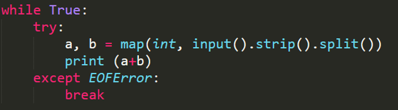

# C语言的数据范围
* int的数据范围[$-2^{31},2^{31}-1(2147483647 2.1*10^9)$]
* unsigned int $4.3*10^9$
* long long [$-2^{63} , 2^{63}-1(9.2*10^{18})$]
* unsigned long long $1.84*10^{19}$ 
  
# 高精度计算

## 大数的压位存储
* 在时间上，数组的长度过大也会导致TLE。O(n)
  
  

## 大数结构体

```c++
const int MAXN = 10000;
const int BASE = 100000; // NBASE个0，用于压位存储
const int NBASE = 5; // 压5位存储，为0就是不压位
typedef struct BigNum
{
	int len, val[MAXN];
}BigNum;
```

## 将读入的字符串转为大数

```c++
BigNum str2num(string str)
{
	int length = str.length();
	int low = 0;
	// 去掉前导零
	while (str[low] == '0')
		low++;
	BigNum A;
	A.len = 0;
	memset(A.val, 0, sizeof(A.val));
	for (int i = length - 1; i >= low; i -= NBASE)
	{
		int value = 0;
		for (int j = NBASE - 1; j >= 0; j--)
		{
			if (i >= j)
			{
				value = value * 10 + (str[i - j] - '0');
			}
		}
		A.val[A.len++] = value;
	}
	return A;
}
```

## 输出大数

```c++
void output(BigNum A)
{
	if (A.len == 0)
	{
		printf("0\n"); return;
	}
	// 最高位去除前导零，中间位补充占位零
	printf("%d", A.val[A.len - 1]);
	for (int i = A.len - 2; i >= 0; i--)
	{
		// 是压几位存储就输出几位，注意要补0输出
		printf("%05d", A.val[i]);
	}
	printf("\n");
}
```

## 高精度加法

```c++
BigNum add(BigNum A, BigNum B)
{
	int sum = 0, carry = 0;
	BigNum C;
	memset(C.val, 0, sizeof(C.val));
	C.len = A.len > B.len ? A.len : B.len;
	for (int i = 0; i < C.len; i++)
	{
		sum = A.val[i] + B.val[i] + carry;
		C.val[i] = sum % BASE; // BASE=100000 压5位存储
		carry = sum / BASE; // BASE=100000 压5位存储
	}
	if (carry != 0)C.val[C.len++] = carry;
	return C;
}
```

## 高精度乘法

```c++
// 两个大整数相乘
BigNum multi(BigNum A, BigNum B)
{
	int sum = 0, carry = 0; // ll sum=0,carry=0;
	BigNum C;
	C.len = A.len+B.len;
	memset(C.val, 0, sizeof(C.val));
	for (int j = 0; j < B.len; j++)
	{
		for (int i = 0; i <= A.len; i++)
		{
			// 五位数x五位数会爆longlong
			// sum = C.val[i + j] + 1ll*A.val[i] * B.val[j] + carry;
			sum = C.val[i + j] + A.val[i] * B.val[j] + carry;
			C.val[i + j] = sum%BASE;
			carry = sum / BASE;
		}
	}
	// 去掉前导零
	while (C.val[C.len - 1] == 0 && C.len > 1)C.len--;
	return C;
}

// 高精度×低精度
// b_len整数b的长度 这个处理不太好，不如直接把int转为大整数结构体
BigNum multi(BigNum A,int b,int b_len){
	int sum=0,carry=0;
	BigNum C;
	memset(C.val, 0, sizeof(C.val));
	C.len=A.len+b_len;
	for(int j=0;j<A.len;j++){
		sum=C.val[j]+A.val[j]*b+carry;
		C.val[j]=sum%BASE;
		carry=sum/BASE;
	}
	while(C.val[C.len-1]==0&&C.len>1)C.len--;
	return C;
}
```

## 高精度比较

```c++
// A比B大返回1，否则返回0
int compare(BigNum A, BigNum B) {
	if (A.len>B.len)
		return 1;
	else if (A.len<B.len)
		return -1;
	else {
		int len = A.len;
		for (int i = len - 1; i >= 0; i--) {
			if (A.val[i]>B.val[i])
				return 1;
			if (A.val[i]<B.val[i])
				return -1;
		}
		return 0;
	}
}
```


## 高精度减法


```c++

BigNum substract(BigNum A,BigNum B){
	int diff=0,borrow=0;
	BigNum C;
	memset(C.val,0,sizeof(C.val));
	C.len=A.len>B.len?A.len:B.len;
	for(int i=0;i<C.len;i++){
		diff=A.val[i]-B.val[i]-borrow;
		C.val[i]=(diff+BASE)%BASE;
		borrow=diff<0?1:0;
	}
	while(C.val[C.len-1]==0&&C.len>1)C.len--;
	return C;
} 

int main(){
	BigNum A,B;
	// 输入操作
	int cmp=compare(A,B);
	if(cmp==1){
		BigNum C=substract(A,B);
		output(C);
	}
	else{
		BigNum C=substract(B,A);
		printf("-");
		output(C);
	}
}

```

## 高精度除法

```c++
// 高精度除以低精度
BigNum divide(BigNum A,int b,int &rest){
	int ans=0;
	BigNum C;rest=0;
	memset(C.val,0,sizeof(C.val));C.len=0;
	if(b==0){
		printf("除数为零");
		return C;
	}
	C.len=A.len;
	for(int i=A.len-1;i>=0;i--){
		ans=rest*BASE+A.val[i];
		C.val[i]=ans/b;
		rest=ans%b;
	}
	while(C.val[C.len-1]==0&&C.len>1)C.len--;
	return C;
}

// 高精度除以高精度

```

## 高精度小数


# 进制转换

* 结构体
  
* 将10进制转化为R进制
  
* 将R进制转化为10进制
  

# Python 


# JAVA


* Java语言的math包里有BigInteger类和BigDecimal类，在ACM比赛中可以直接调用类里封装好的函数。
* 注意：Java有时会把较大的实数以科学计数法的形式输出。
  ```java
  import java.text.NumberFormat;

	public class test {
		
		public static void main(String[] args) {
			double d =12345.00000000225168d;
			String s=formatDouble(d);
			System.out.println(s);
		}
		private static String formatDouble(double d) {
				NumberFormat nf = NumberFormat.getInstance();
				//设置保留多少位小数
				nf.setMaximumFractionDigits(20);
				// 取消科学计数法
				nf.setGroupingUsed(false);
				//返回结果
				return nf.format(d);
			}
	}
  ```
# 输入输出外挂


```c++
namespace fastIO{
	const int BUF_SIZE=4e7; // 估算输入数据的大小，每个char占1个字节。
	char buf[BUF_SIZE];
	int _fc,_fsize;
	// 注意要在main()函数的最开始加入begin()函数。
	void begin(){
		_fc=0;
		_fsize=fread(buf,1,BUF_SIZE,stdin);
	}
	template<typename T>
	inline bool read(T &t){
		while(_fc<_fsize && buf[_fc]!='-' && (buf[_fc]<'0'||buf[_fc]>'9')) _fc++;
		if(_fc>=_fsize) return false;
		bool sgn=0; if(buf[_fc]=='-'){ sgn=1; _fc++; }
		for(t=0;_fc<_fsize&&'0'<=buf[_fc]&&buf[_fc]<='9';_fc++) t=t*10+buf[_fc]-'0';
		if(sgn) t=-t;
		return true;
	}
	template<typename T>
	void print(T x){
  		static char _ss[33],*st; st=_ss;
 		if(!x) *st++='0';
		if(x<0){ putchar('-'); x=-x;}
 		while(x){ *st++=('0'+x%10); x/=10; }
		while((st--)!=_ss) putchar(*st);
		return ;
	}
	inline bool reads(char _ss[]){
		while(_fc<_fsize && (buf[_fc]==' ' || buf[_fc]=='\n')) _fc++;
		if(_fc>=_fsize) return false;
		int len=0;
		for(len=0;_fc<_fsize&&buf[_fc]!=' '&&buf[_fc]!='\n';_fc++)
			_ss[len++]=buf[_fc];
		_ss[len]='\0';
		return true;
	}
}
using namespace fastIO;

```
